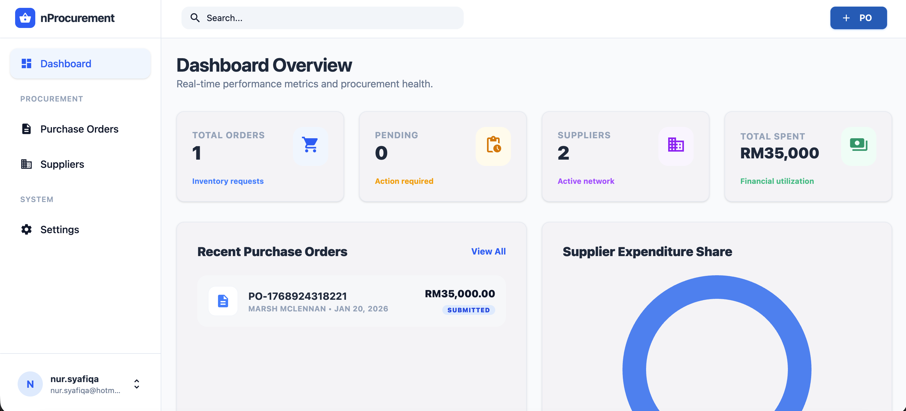
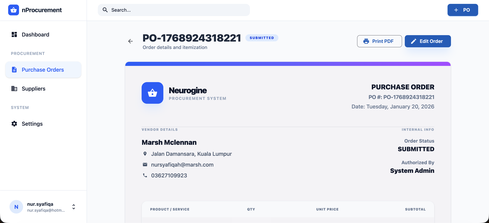

# 📦 Procurement Management System

A high-fidelity, responsive procurement application. This system streamlines the creation, management, and tracking of Purchase Orders (POs) and Suppliers with a modern and user-friendly interface.




## Features

- **Dashboard**: Real-time visualization of procurement metrics using Chart.js, including expenditure share and order status summaries.
- **Supplier Management**: Full CRUD operations for vendors with a clean, searchable interface.
- **Purchase Order Workflow**: 
  - Interactive PO creation with live subtotal calculations.
  - Multi-status support (Draft, Submitted).
  - Itemized order tracking.
- **Professional Detail View**: A document-style PO details view with built-in **Print to PDF** support, optimized for business records.
- **Fully Responsive**: Responsive design system ensuring a perfect experience from smartphones to large desktop monitors.
- **Secure Architecture**: Token-based authentication flow with protected routes and state-management.

## Tech Stack

- **Core**: Angular 19 (Standalone Components, Signals)
- **Styling**: Tailwind CSS & Vanilla CSS
- **UI Components**: Angular Material
- **Data Visualization**: Chart.js
- **Icons**: Material Icons / Google Symbols
- **Typography**: Inter & Outfit (Google Fonts)

## Getting Started

### Prerequisites

- [Node.js](https://nodejs.org/) (v18.x or higher)
- [npm](https://www.npmjs.com/) (v9.x or higher)

### Installation

1. Clone the repository:
   ```bash
   git clone https://github.com/hanifomarr/procurement-app-fe.git
   cd procurement-app-fe
   ```

2. Install dependencies:
   ```bash
   npm install
   ```

3. Start the development server:
   ```bash
   npm start
   ```

4. Open your browser to `http://localhost:4200`